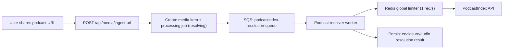

# PodcastIndex Rate Limiting Architecture (Share-Only)

## Status
- Accepted (implemented for task-9 scope)
- Last updated: 2026-03-01

## Decision context (updated)

This ADR supersedes the previous legacy assumption of two distinct traffic families
(`manual podcast search` vs `async playlist sync`).

Current product architecture is now:
- no Spotify playlist sync
- no end-user manual podcast search flow as a product requirement
- a single entry path for podcasts: user shares a podcast URL into the app, then ingestion resolves to `enclosureUrl` through PodcastIndex

The key constraint remains unchanged:
- PodcastIndex enforces a strict global limit of `1 request / second` per API key.

## Problem

Without a global coordinator, concurrent requests from multiple API instances/workers can:
- breach PodcastIndex quota
- generate `429` errors
- create unstable UX and retries

Goal:
- absorb bursts safely
- avoid user-visible `429`
- keep behavior deterministic in multi-instance deployments

## Options considered in the new context

### Option A - Distributed Redis limiter only (inline calls)
- Principle: every PodcastIndex call acquires a global slot in Redis (atomic), then calls PodcastIndex.
- Pros:
  - simple conceptual model
  - multi-instance safe if implemented correctly
  - minimal extra infra beyond Redis
- Cons:
  - request-path latency grows directly under burst
  - API workers may spend time waiting/sleeping
  - harder backpressure control compared to a queue

### Option B - Dedicated PodcastIndex queue + worker + Redis hard guard
- Principle:
  - enqueue PodcastIndex resolution work
  - dedicated worker consumes queue
  - worker enforces global `1 req/s` via Redis limiter before each external call
- Pros:
  - true backpressure: bursts stay in queue, not in API threads
  - stable user path (`ingest-url` returns quickly, processing continues)
  - clean operational controls (DLQ, retries, queue depth alarms)
  - multi-instance safe with Redis hard guard
- Cons:
  - extra moving parts (queue + worker + observability)
  - eventual consistency (resolution is asynchronous by design)

### Option C - Per-instance local sleep limiter
- Principle: each instance sleeps locally between calls.
- Verdict: rejected.
- Reason: not safe in multi-instance, cannot enforce global quota.

## Recommended decision

Recommendation: **Option B** with **single API key** (no manual/async split).

Why:
- the product is now share-first and inherently async for media processing
- queue-first architecture gives better burst handling and protects API latency
- Redis limiter still guarantees strict global rate compliance across workers/instances

## Detailed rationale: why Option B over Option A

Decision drivers for current product constraints:

1. API responsiveness on share intake (`POST /api/media/ingest-url`)
- Option A (inline limiter): API path can be blocked waiting for limiter slots during bursts.
- Option B (queue-first): API returns quickly after enqueue; waiting happens off-request in workers.
- Impact: Option B preserves a predictable intake UX under concurrent shares.

2. Backpressure behavior under bursts
- Option A: pressure accumulates in API instances (pending requests, long response times, possible timeouts).
- Option B: pressure accumulates in queue depth, which is explicit and controllable.
- Impact: Option B gives a safer failure mode and better burst absorption.

3. Multi-instance operational determinism
- Option A: correct but sensitive to request-time waiting, cancellation, and retry complexity in API tier.
- Option B: single consumption path for PodcastIndex calls, with Redis as hard global guard.
- Impact: Option B is easier to reason about and operate at scale.

4. Reliability controls and recovery
- Option A: retries and retry storms can affect live API capacity.
- Option B: retries are isolated in worker pipeline with DLQ, bounded retries, and replay patterns.
- Impact: Option B reduces blast radius of upstream instability (`429`/timeout/`5xx`).

5. Observability and SLO management
- Option A: bottlenecks show as API latency spikes, mixed with other causes.
- Option B: queue metrics (depth/age), worker metrics, and limiter wait are explicit signals.
- Impact: Option B improves diagnosability and incident response.

6. Infrastructure and complexity trade-off
- Option A: lower infra footprint.
- Option B: adds queue + worker + DLQ and monitoring.
- Impact: we accept extra complexity because it buys predictable UX and stronger operational safety for share bursts.

Summary:
- Option A is viable for low traffic and minimal infrastructure.
- Option B is preferred for production-grade share-first behavior, where controlled latency and stable throughput are more important than minimal infra.

## Target architecture

Key points:
- no `manual vs async` key split
- all PodcastIndex calls pass through one governed pipeline
- Redis limiter is the hard global guardrail

## Runtime behavior and error policy

- `POST /api/media/ingest-url` must not block on PodcastIndex quota wait.
- Under burst, work queues and progresses through status polling (`GET /api/media/{media_item_id}`).
- If PodcastIndex returns transient failures (`429`, timeout, `5xx`):
  - retry with bounded exponential backoff + jitter
  - keep failure details internal/logged
  - expose stable user-safe states (`resolving` -> `failed` with canonical error code)
- No stack traces or provider internals in client-facing messages.

## Configuration and deployment impact

Required:
- `PODCASTINDEXORG_API_KEY`
- `PODCASTINDEXORG_API_SECRET`
- `PODCASTINDEX_RATE_LIMIT_RPS=1`
- `PODCASTINDEX_LIMITER_REDIS_URL`
- `PODCASTINDEX_RESOLUTION_QUEUE` (new)
- `PODCASTINDEX_RESOLUTION_DLQ` (new)
- `PODCASTINDEX_MAX_RETRIES` (bounded retries)

Operational:
- provision queue + DLQ
- run resolver worker service
- add alarms on queue depth, queue age, worker failures, and 429 rate

## Observability requirements

Track at minimum:
- PodcastIndex calls total/success/failure/429
- limiter wait time (p50/p95/p99)
- queue depth and oldest message age
- resolution latency end-to-end
- retry count and terminal failure rate

Structured logs should include:
- `media_item_id`
- `media_key`
- `source_platform`
- attempt number
- limiter wait duration

## Reproducible multi-instance validation

Validation scenario:
1. Start at least 2 resolver worker instances.
2. Inject a burst of N podcast resolution jobs quickly (e.g., 50).
3. Verify global outbound call cadence to PodcastIndex stays <= 1 req/s.
4. Verify no user-visible 429 surfaced in API responses.
5. Verify queue drains and jobs complete/fail deterministically.

Practical local check for the limiter itself:
- `PODCASTINDEX_LIMITER_REDIS_URL=redis://localhost:6379/0 python scripts/verify_podcastindex_limiter_multi_instance.py --workers 4 --iterations 5`
- Expected result: minimum inter-slot gap stays near 1 second (with tolerance).

Success criteria:
- global rate compliance proven by logs/metrics timestamps
- stable processing under burst
- no quota breach side effects for users

## Implementation status (task-9)

Implemented in this repository:
- queue-first routing for podcast resolution jobs (`podcastindex-resolution-queue`)
- dedicated worker (`podcastindex_resolution_worker`) forwarding successful resolutions to `deepgram-transcription-queue`
- Redis-backed global limiter integrated in `podcast_index.py` calls with local fallback for dev resilience
- env/config scaffolding for limiter and queue settings

Current scope:
- RSS-like feed URL resolution path is implemented in this task
- Spotify/Apple/Deezer-specific resolution logic is intentionally left to dedicated resolver tasks (`task-25`, `task-26`, `task-27`)

## Explicit decision checkpoint (to confirm together)

To finalize task-9, confirm the following:
1. We adopt **queue-first resolution** (Option B) as the default for all PodcastIndex calls. ✅ Confirmed on 2026-02-24
2. We keep **single PodcastIndex key pair** (no manual/async split). ✅ Implemented in task-9
3. We enforce `1 req/s` with **Redis global limiter** as mandatory hard guard. ✅ Implemented in task-9
