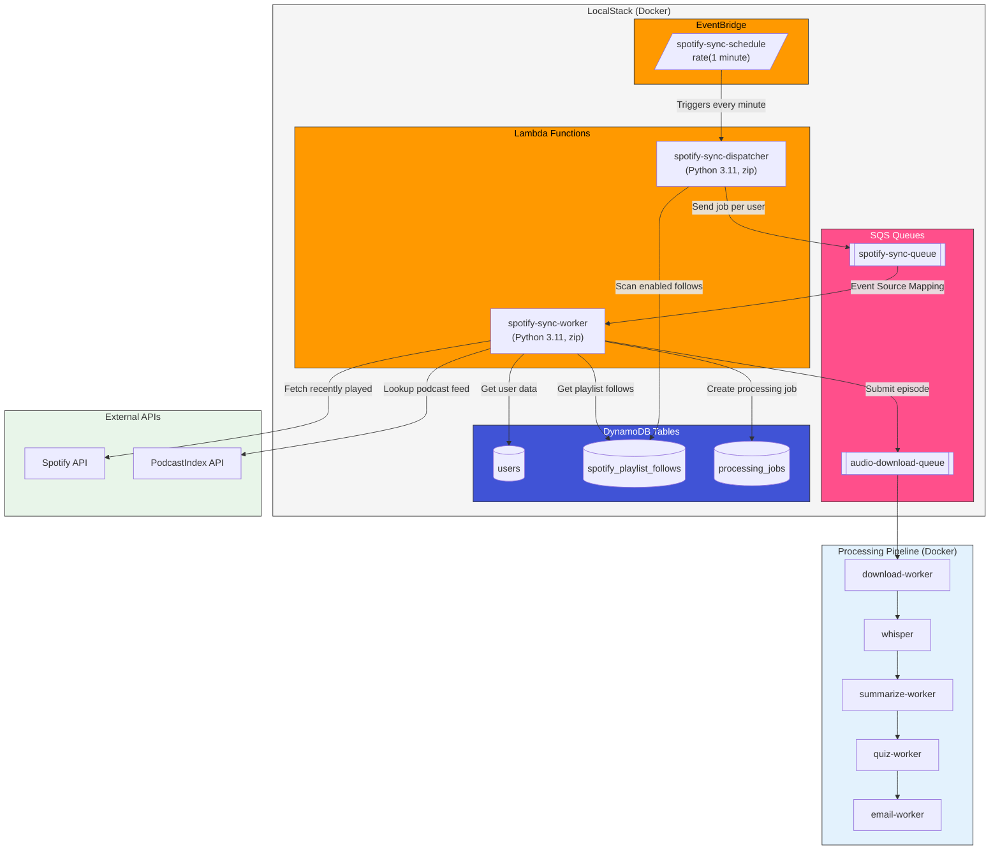
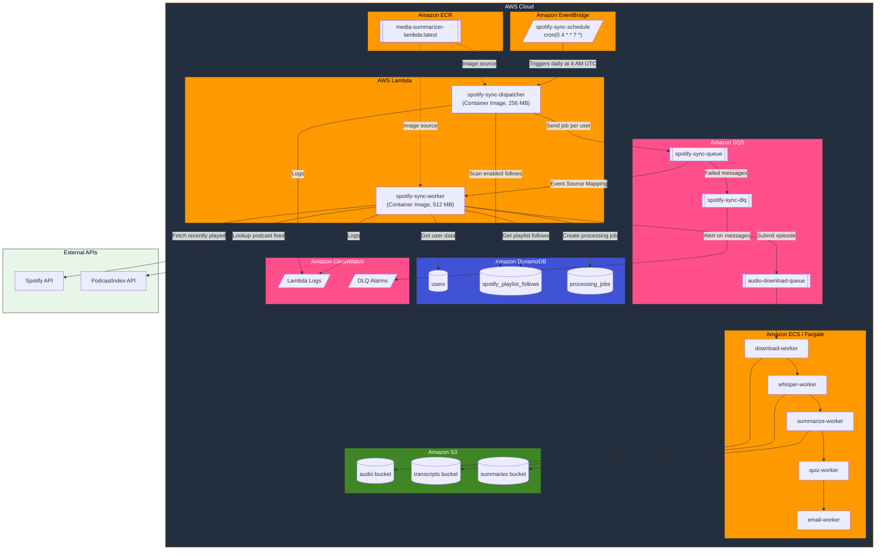

# Spotify Sync Architecture

This document describes the infrastructure architecture for the Spotify Sync feature, which automatically processes podcast episodes from users' Spotify playlists.

## Overview

The Spotify Sync feature follows a serverless, event-driven architecture that is consistent between development and production environments. The main difference is in how the components are deployed and executed.

---

## Development Architecture (LocalStack)

In development, we use **LocalStack** to emulate AWS services. Lambda functions are deployed as zip packages and triggered by emulated EventBridge and SQS.



### Dev Environment Details

| Component | Implementation | Notes |
|-----------|---------------|-------|
| EventBridge | LocalStack emulation | `rate(1 minute)` schedule |
| Lambda Functions | Zip packages (21 MB) | Built via `deploy_lambdas_localstack.sh` |
| SQS | LocalStack emulation | Event source mapping enabled |
| DynamoDB | LocalStack emulation | Persistent via volume mount |
| Processing Workers | Docker containers | Run via docker-compose |

### Deployment Commands (Dev)

```bash
# Start LocalStack and apply Terraform
docker-compose --env-file .env.dev -f docker-compose.dev.yml up -d localstack
docker-compose --env-file .env.dev -f docker-compose.dev.yml up terraform

# Deploy Lambda functions
./scripts/deploy_lambdas_localstack.sh

# Start processing workers
docker-compose --env-file .env.dev -f docker-compose.dev.yml up -d \
  download-worker whisper summarize-worker quiz-worker email-worker
```

---

## Production Architecture (AWS)

In production, we use native AWS services. Lambda functions are deployed as **Docker container images** stored in ECR for better performance and dependency management.



### Prod Environment Details

| Component | Implementation | Notes |
|-----------|---------------|-------|
| EventBridge | Native AWS | `cron(0 4 * * ? *)` - Daily at 4 AM UTC |
| Lambda Functions | Container Images (ECR) | Faster cold starts, better dependency management |
| SQS | Native AWS with DLQ | Dead Letter Queue for failed messages |
| DynamoDB | Native AWS | On-demand capacity mode |
| Processing Workers | ECS Fargate | Auto-scaling based on queue depth |
| Monitoring | CloudWatch | Logs, metrics, and alarms |

### Deployment Commands (Prod)

```bash
# Build and push Lambda container image
docker build -t media-summarizer-lambda:latest -f infrastructure/docker/lambda.Dockerfile .
aws ecr get-login-password | docker login --username AWS --password-stdin <account>.dkr.ecr.<region>.amazonaws.com
docker tag media-summarizer-lambda:latest <account>.dkr.ecr.<region>.amazonaws.com/media-summarizer-lambda:latest
docker push <account>.dkr.ecr.<region>.amazonaws.com/media-summarizer-lambda:latest

# Apply Terraform
cd infrastructure/terraform/aws
terraform init
terraform apply -var="ecr_repository_url=<account>.dkr.ecr.<region>.amazonaws.com/media-summarizer-lambda"
```

---

## Key Differences: Dev vs Prod

| Aspect | Development | Production |
|--------|-------------|------------|
| **EventBridge Schedule** | `rate(1 minute)` | `cron(0 4 * * ? *)` (daily) |
| **Lambda Packaging** | Zip files (21 MB) | Container images (ECR) |
| **Lambda Cold Start** | Slower (LocalStack limitation) | Fast (AWS optimized) |
| **Dead Letter Queues** | Optional | Configured with alarms |
| **Monitoring** | Docker logs | CloudWatch Logs + Alarms |
| **Processing Workers** | Docker Compose | ECS Fargate |
| **AWS Endpoint** | `http://localhost:4566` | Native AWS endpoints |

---

## Data Flow Summary

1. **EventBridge** triggers the **Dispatcher Lambda** on schedule
2. **Dispatcher** scans `spotify_playlist_follows` for enabled playlists
3. **Dispatcher** sends one SQS message per user to `spotify-sync-queue`
4. **SQS Event Source Mapping** triggers **Worker Lambda** for each message
5. **Worker** fetches the user's recently played episodes from Spotify API
6. **Worker** filters episodes by listen threshold (80%+)
7. **Worker** looks up podcast feed URLs via PodcastIndex API
8. **Worker** creates processing jobs and submits to `audio-download-queue`
9. **Processing Pipeline** handles download → transcription → summarization → quiz → email

---

## Files Reference

| File | Purpose |
|------|---------|
| `scripts/deploy_lambdas_localstack.sh` | Deploy Lambdas to LocalStack (dev) |
| `infrastructure/docker/lambda.Dockerfile` | Lambda container image (prod) |
| `infrastructure/terraform/localstack/main.tf` | LocalStack infrastructure (dev) |
| `infrastructure/terraform/aws/spotify_sync.tf` | AWS infrastructure (prod) |
| `media_summarizer/workers/spotify_sync/dispatcher.py` | Dispatcher Lambda handler |
| `media_summarizer/workers/spotify_sync/worker.py` | Worker Lambda handler |